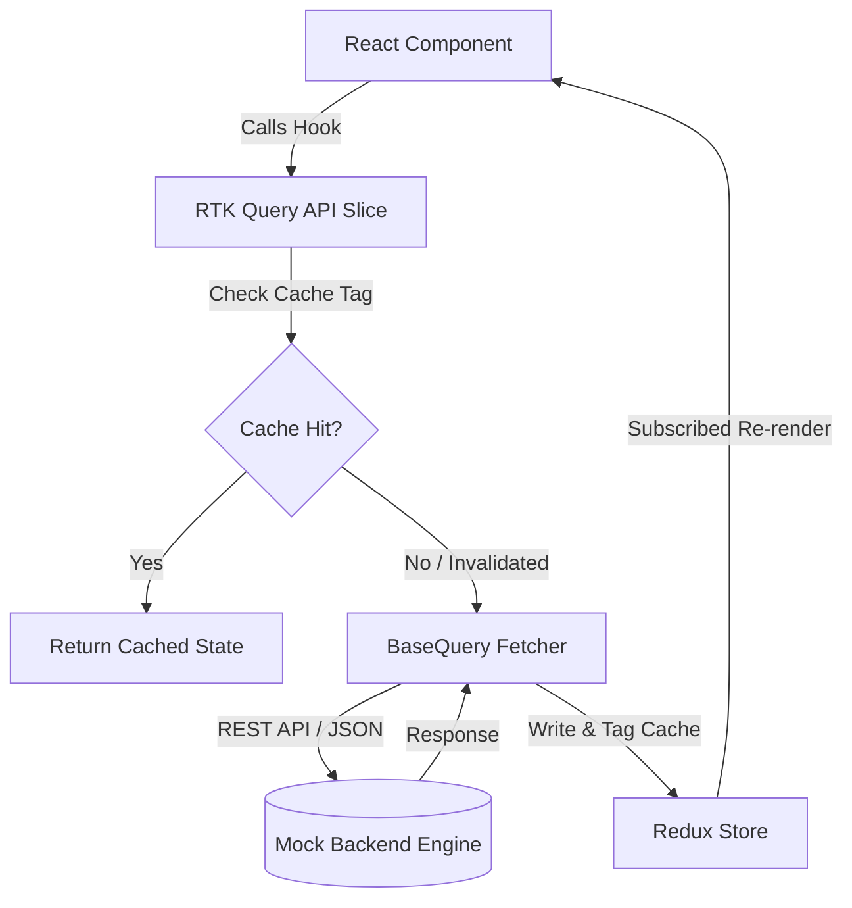
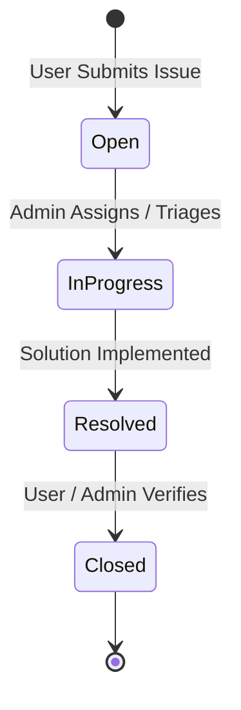

# Enterprise IT Helpdesk & Service Management System

[](#)
[](#)
[](#)
[](#)
[](#)
[](https://opensource.org/licenses/MIT)

> A robust, multi-role ITIL-compliant Service Desk and Asset Management dashboard designed to handle incident resolution workflows, technician scheduling, real-time messaging, and equipment tracking.

---


## ⚡ Key Highlights & Engineering Features

- **Role-Based Access Control (RBAC):** Strict front-end route guards differentiating `user` and `admin` portals, with synchronized state redirection.
- **Data Integrity & State Normalization:** Leverages **RTK Query** with fine-grained tag invalidation (`LIST` vs `{ type: 'Ticket', id }`), auto-revalidation on focus/network reconnect, and short-interval polling.
- **Incident & Asset Relationship Rules:** Custom validation ensuring an asset cannot have more than one open or active ticket simultaneously.
- **Resilient Authentication Flow:** Supports credential login, single-use OTP authentication via EmailJS, and a seamless fallback toast delivery mode for offline evaluation.
- **Comprehensive Activity Auditing:** Full audit trail tracking every operational mutation (assignment, status progression, remarks) with UTC timestamps.
- **Accessible & Adaptive UX:** Integrated system-aware dark/light theme persistence, multi-step user onboarding using `driver.js`, and responsive multi-pane split layouts.

---

## 🛠️ Tech Stack

| Layer | Technology / Library | Architectural Role |
| :--- | :--- | :--- |
| **Runtime & Core** | React 19, TypeScript (Strict Mode) | Predictable typing, latest concurrent features |
| **State & Cache** | Redux Toolkit, RTK Query | Normalized API cache, mutations, tag invalidation |
| **UI & Styling** | Material UI (v9), Emotion, Fontsource Inter | Component design system, theme tokens |
| **Validation** | React Hook Form, Zod | Schema-based client-side form validation |
| **Routing** | React Router v6 | Declarative layout nesting, role-based guards |
| **Tooling & Build** | Vite, ESLint | Instant HMR, static analysis |
| **Mock Engine** | JSON-Server (Node.js) | Local RESTful backend simulation |

---

## 📐 System Architecture & Data Flow



### Ticket Lifecycle Flow



---

## 📁 Repository Structure

```text
src/
├── app/                  # Application bootstrap (Redux store, middlewares)
├── components/
│   ├── admin/            # Admin-only domain views (Queue, Assets, Metrics)
│   ├── auth/             # Login, Signup, OTP, and Role Selection
│   ├── shared/           # Layouts, Sidebar, Timeline, and Chat interface
│   └── user/             # End-user views (Overview, Self-service, Tickets)
├── features/             # Feature-sliced RTK Query endpoints & slices
│   ├── api/baseApi.ts    # Central baseQuery and tag registration
│   ├── appointments/     # Appointment endpoints & queries
│   ├── assets/           # Equipment lifecycle queries
│   ├── auth/             # Auth state slice and token management
│   ├── chat/             # Direct messaging queries
│   └── tickets/          # Incident management APIs
├── lib/                  # Utilities, custom typed hooks, theme providers
└── types/                # Global domain contracts & TypeScript interfaces
```

---

## 🚀 Getting Started

### Prerequisites

- **Node.js**: `v18.0.0` or higher
- **npm**: `v9.0.0` or higher (or `pnpm` / `yarn`)

### Installation & Local Setup

1. **Clone the repository:**
   ```bash
   git clone [https://github.com/Antrit0s/Ticket-System.git](https://github.com/Antrit0s/Ticket-System.git)
   cd Ticket-System
   ```

2. **Install project dependencies:**
   ```bash
   npm install
   ```

3. **Configure Environment Variables:**
   Create a `.env` file in the project root:
   ```env
   VITE_API_URL=http://localhost:3000
   VITE_EMAILJS_SERVICE_ID=your_optional_service_id
   VITE_EMAILJS_TEMPLATE_ID=your_optional_template_id
   ```
   > *Note: If EmailJS credentials are omitted, generated OTPs will automatically log to a toast notification for ease of testing.*

4. **Run the local environment:**
   ```bash
   # Starts Vite (port 5173) and json-server (port 3000) concurrently
   npm run dev:all
   ```
   Visit `http://localhost:5173` in your browser.

---

## 🔑 Test Credentials

| Role | Email | Password | Primary Capabilities |
| :--- | :--- | :--- | :--- |
| **Admin** | `support@company.com` | `password123` | Queue triage, Asset inventory, User roles, Metrics |
| **User** | `mariam.tarek@company.com` | `password123` | Asset-linked ticket creation, Appointments, Chat |
| **User** | `omar.khaled@company.com` | `password123` | Standard self-service portal |

---

## 📜 Available Scripts

| Command | Action |
| :--- | :--- |
| `npm run dev` | Runs the Vite client development server. |
| `npm run server` | Starts the mock `json-server` on port `3000`. |
| `npm run dev:all` | Launches both Vite and JSON server concurrently. |
| `npm run build` | Compiles production assets into the `dist/` directory. |
| `npm run preview` | Spins up a local web server to preview production build. |
| `npm run lint` | Runs ESLint to check for stylistic and syntax problems. |

---

## ⚠️ Architectural Trade-offs & Production Considerations

This repository is optimized for demonstrating front-end architecture, UI execution, and local development speed. If deploying to high-scale enterprise environments:

- **Mock Backend:** `json-server` does not implement atomic transactions or row-level locking. In a full production deployment, a real backend (e.g., NestJS / Go / Express + PostgreSQL) should be utilized.
- **Client-Side Auth Token:** Authentication is simulated via local storage and deterministic tokens for offline evaluation. Production systems should use `HttpOnly` Secure Cookies with JWT/Refresh token rotation.
- **Communication Protocol:** The messaging and ticket update mechanism currently uses optimized short polling (3–5 seconds). WebSockets or Server-Sent Events (SSE) should replace polling for higher efficiency at scale.

---

## 📚 References & Resources

This project was built using the following official documentation and community resources.

### Core Framework & Tooling

- [React 19 Documentation](https://react.dev/) — Hooks, Strict Mode, and modern patterns.
- [Vite — Getting Started](https://vitejs.dev/guide/) — Build tooling and dev server setup.
- [TypeScript Handbook](https://www.typescriptlang.org/docs/handbook/intro.html) — Strict typing, generics, and module augmentation.

### State Management

- [Redux Toolkit — Overview](https://redux-toolkit.js.org/) — `configureStore`, slices, and middleware.
- [RTK Query — Quick Start](https://redux-toolkit.js.org/rtk-query/overview) — `createApi`, `injectEndpoints`, tag-based caching.
- [RTK Query — Automated Re-fetching](https://redux-toolkit.js.org/rtk-query/usage/automated-refetching) — Tag invalidation patterns.

### UI & Design System

- [Material UI v9 Documentation](https://mui.com/material-ui/getting-started/) — Components, theming, `sx` prop.
- [MUI Customization — Theming](https://mui.com/material-ui/customization/theming/) — `createTheme`, palette extension.
- [MUI Switch — Customization](https://mui.com/material-ui/react-switch/#customization) — Source for `MaterialUISwitch.tsx`.
- [MUI X Date Pickers](https://mui.com/x/react-date-pickers/getting-started/) — `DateTimePicker`, `AdapterDayjs`.
- [Emotion — CSS-in-JS](https://emotion.sh/docs/introduction) — Underlying styling engine for MUI.
- [Fontsource — Inter](https://fontsource.org/fonts/inter) — Self-hosted font imports.

### Forms & Validation

- [React Hook Form](https://react-hook-form.com/) — `useForm`, `Controller`, `useWatch`.
- [Zod](https://zod.dev/) — Schema validation.
- [@hookform/resolvers](https://github.com/react-hook-form/resolvers) — `zodResolver` integration.

### Routing

- [React Router v6](https://reactrouter.com/en/main) — Nested routes, `Outlet`, `Navigate`.

### UX Enhancements

- [driver.js](https://driverjs.com/docs/installation) — Onboarding tour engine.
- [React Toastify](https://fkhadra.github.io/react-toastify/introduction/) — Toast notifications.

### Backend & Services

- [json-server](https://github.com/typicode/json-server) — RESTful mock backend.
- [EmailJS](https://www.emailjs.com/docs/) — Client-side email delivery for OTP.

### Deployment

- [Vercel — Vite Deployment](https://vercel.com/docs/frameworks/vite) — Frontend hosting + SPA rewrites.
- [Render — Web Services](https://render.com/docs/web-services) — Node.js backend hosting.

### Design & Icons

- [MUI Icons](https://mui.com/material-ui/material-icons/) — Icon set used throughout the app.

### Inspiration & Patterns

- ITIL v4 Incident Management workflows — basis for the ticket lifecycle.
- Common patterns from enterprise helpdesk tools (Jira Service Management, Zendesk, Freshdesk).

---
## 📄 License

This project is licensed under the MIT License — feel free to explore, clone, and modify for learning and showcase purposes.
